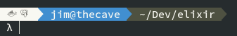
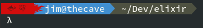
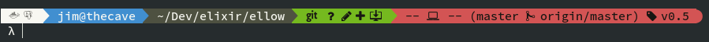

# gnome-terminal-gitprompt
Customized gnome-terminal prompt with git insight

### Sections
- services: background reflects loads.
- user@host
- path
- git info

##### Base prompt with low load

##### Base prompt with medium load

##### Base prompt with high load

###### Prompt including git. Inspired by and most code from [oh-my git](https://github.com/arialdomartini/oh-my-git/blob/master/README.md)

##### As root user.  Simple: no services, load indication or git info

### Available services:
- docker
- postgresql
- mysqld
- mariadb

### Todo:
- make services more dynamic so they can easily added/removed
