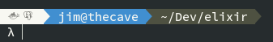

# gnome-terminal-gitprompt
Customized gnome-terminal prompt with git insight

### Sections
- services: currently hardcoded for docker, postgresql & mysql
- user@host
- path
- git info

##### Base prompt with services, user@host, and path

###### Prompt including git. Inspired by and most code from [oh-my git](https://github.com/arialdomartini/oh-my-git/blob/master/README.md)

### Todo:
- make services dynamic and be able to easily add/remove